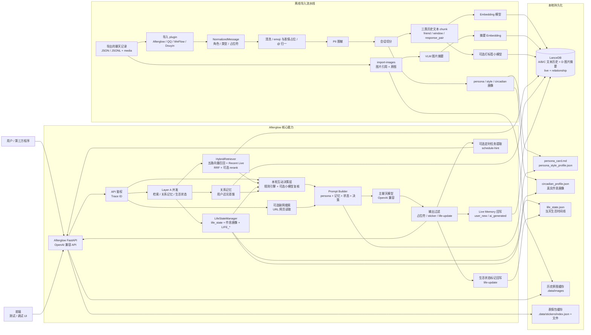

<div align="center">

# 🌅 Afterglow · 续温

**把曾经对你好的话，续成往后的陪伴。**

从真实历史聊天中构建可检索的关系记忆、人格与表达风格，  
通过 RAG + Persona + OpenAI 兼容 API，让熟悉的语气继续留在对话里。

<p>
  <a href="https://afterglow.kldhsh.top/">官网</a> ·
  <a href="https://github.com/kldhsh123/Afterglow/wiki/快速开始">快速开始</a> ·
  <a href="#整体架构">整体架构</a> ·
  <a href="https://github.com/kldhsh123/Afterglow/wiki">使用文档</a> ·
  <a href="https://qm.qq.com/cgi-bin/qm/qr?k=7rvmrvR100Is9aAp0ZsjmfiG7e0Cv6ZB&amp;jump_from=webapi&amp;authKey=mEN/epjvPHcT+Sb61/XO0Mi5egs2xJBhZm9Wm5MmgEWrpNa0ZOY3fzUf+pvqfijD">QQ 群</a> ·
  <a href="https://afdian.com/a/kldhsh123">赞助支持</a> ·
  <a href="https://github.com/kldhsh123/Afterglow/releases/latest">下载版本</a>
</p>

<p>
  <a href="https://github.com/kldhsh123/Afterglow/releases/latest"></a>
  <a href="https://github.com/kldhsh123/Afterglow/blob/main/LICENSE"></a>
  <a href="https://github.com/kldhsh123/Afterglow/commits/main"></a>
  <a href="https://github.com/kldhsh123/Afterglow/issues"></a>
</p>

</div>

---

> [!IMPORTANT]
> **我们需要你的回音** 💌  
> 无论你是遇到了部署报错、发现了 Bug，还是 Afterglow 帮你在某个瞬间找回了熟悉的温度，我都非常想听听你的体验。  
> *（我们会将您的故事以您所要求的匿名，或者显示名称展示在项目的[官方网站](https://afterglow.kldhsh.top/#testimonials)上。）*
>
> 👉 **[点击这里，前往 Discussions 留下你的反馈与故事](https://github.com/kldhsh123/Afterglow/discussions/new?category=general)**

> [!IMPORTANT]
> Afterglow 生成的是 **AI 续写**，不是原型人物本人。请在取得必要授权、理解隐私外发范围，并能清楚区分 AI 与现实人物的前提下使用。严禁冒名顶替、骚扰、诈骗、公开传播私人聊天，或把生成内容伪装成本人的话。
>
> 如果你正处于剧烈丧失、抑郁或自伤风险中，请优先联系现实中的亲友和专业支持。完整说明见[负责任使用与数据隐私](https://github.com/kldhsh123/Afterglow/wiki/负责任使用与数据隐私)。

## 它是什么

Afterglow 是一个本地运行的 AI 朋友系统。它把真实聊天记录清洗、切分并向量化，再结合 persona、作息画像、生活状态与关系记忆，为主模型提供和当前对话相关的历史证据。

它不是微调，也不会改变模型权重；它不是“复活”某个人，更不能替代现实关系。最终效果取决于聊天记录数量、原型人物的语言辨识度和所选模型能力。

## 核心能力

| 能力 | 说明 |
|---|---|
| 多源导入 | 支持 QQChatExporter、WeFlow、Douyin Chat Export、Afterglow Chat 的 JSON / JSONL，以及多文件画像合并 |
| 分层混合检索 | 三类历史文本、历史图片摘要与 Live 记忆五路向量召回，RRF 融合并可选 Query Rewrite / Reranker |
| 人格与状态 | Persona、场景风格、作息画像、生活时间线、关系记忆与互动决策 |
| 记忆分层 | 区分真人历史、用户新消息和 AI 回复，默认防止 AI 内容污染长期人格 |
| 开放接入 | 同时提供 OpenAI Chat Completions 与 Responses API，可接入第三方客户端 |
| 本地优先 | LanceDB、本地 persona 和资源缓存，支持 PII 脱敏、Bearer 鉴权与全离线模型服务 |

## 项目生态

- [Afterglow-QQBot](https://github.com/kldhsh123/Afterglow-QQBot)：QQBot 适配器
- [Afterglow-WeiXinBot](https://github.com/kldhsh123/Afterglow-WeiXinBot)：微信 Bot 适配器

## 整体架构



- **离线导入**：文本生成 A/B/C 三类历史索引和人格画像；可选图片导入使用 VLM 生成摘要，写入 D 类 `history_images` 向量表。
- **在线对话**：HybridRetriever 并发执行五路向量召回并读取 Recent Live；外层再与关系记忆、生活状态并发，经互动决策组装 Prompt。
- **本地持久化**：向量、persona、作息、生活状态、图片与表情资源默认保存在本机。

完整能力地图和关键设计见[架构文档](https://github.com/kldhsh123/Afterglow/wiki/整体架构)。

## 快速开始

### Docker

```bash
mkdir -p ~/afterglow && cd ~/afterglow
curl -fsSLo compose.yaml \
  https://raw.githubusercontent.com/kldhsh123/Afterglow/main/docker/compose.standalone.yaml
docker compose pull && docker compose up -d
docker compose logs backend | grep -iE "token|/config/"
```

复制日志中的一次性 setup token，打开 `http://localhost:8000/config/` 完成 8 步向导。配置会写入当前目录的 `.env`，数据保存在 `.data/`；完成后执行：

```bash
docker compose restart backend
```

完整的挂载、升级和运维说明见 [Docker 部署](https://github.com/kldhsh123/Afterglow/wiki/Docker部署与运维)。

### 源码运行

需要 Python 3.12+ 和 [uv](https://github.com/astral-sh/uv)。首次使用推荐配置向导：

```bash
cd backend
uv sync --extra dev
uv run uvicorn xuwen.chat_api.app:create_app --factory --reload
```

终端会在缺少关键配置时打印一次性 token。打开 `http://127.0.0.1:8000/config/`，完成身份、模型、聊天导入与访问密码配置，然后重启后端。

完整步骤、前端启动和第三方客户端接入见[快速开始](https://github.com/kldhsh123/Afterglow/wiki/快速开始)。

## 支持的聊天格式

| 来源 | 格式 | 说明 |
|---|---|---|
| [QQChatExporter](https://github.com/shuakami/qq-chat-exporter) | JSON、chunked JSONL | 推荐的 QQ 导入方式 |
| [WeFlow Releases](https://github.com/hicccc77/weflow-releases/) | arkme-json、ChatLab JSONL | 微信导入；当前发布版非开源，请评估隐私与安全风险 |
| [Douyin Chat Export](https://github.com/TeamBreakerr/douyin-chat-export) | ChatLab JSON、JSONL | 抖音私信导入；图片仅保留占位符 |
| Afterglow Chat v1 | JSON、typed / bare JSONL | 稳定、平台无关的专用中间格式 |

其它来源可以转换为 [Afterglow Chat v1](https://github.com/kldhsh123/Afterglow/wiki/Afterglow专用导入格式) 快速接入。长期维护或公开分发时，仍建议实现独立 ingestion plugin 并提交 PR。

## 文档

- **开始使用**：[快速开始](https://github.com/kldhsh123/Afterglow/wiki/快速开始) · [配置参考](https://github.com/kldhsh123/Afterglow/wiki/配置参考) · [后端环境变量](https://github.com/kldhsh123/Afterglow/wiki/后端环境变量) · [Docker](https://github.com/kldhsh123/Afterglow/wiki/Docker部署与运维) · [故障排查](https://github.com/kldhsh123/Afterglow/wiki/故障排查)
- **数据导入**：[导入聊天记录](https://github.com/kldhsh123/Afterglow/wiki/导入聊天记录) · [Afterglow Chat v1](https://github.com/kldhsh123/Afterglow/wiki/Afterglow专用导入格式) · [人格模板](https://github.com/kldhsh123/Afterglow/wiki/自定义人格模板)
- **原理与参考**：[整体架构](https://github.com/kldhsh123/Afterglow/wiki/整体架构) · [后端 API](https://github.com/kldhsh123/Afterglow/wiki/后端API文档) · [FAQ](https://github.com/kldhsh123/Afterglow/wiki/常见问题) · [安全与隐私](https://github.com/kldhsh123/Afterglow/wiki/负责任使用与数据隐私)
- **开发贡献**：[开发文档](https://github.com/kldhsh123/Afterglow/wiki/开发文档) · [贡献指南](CONTRIBUTING.md) · [文档维护](https://github.com/kldhsh123/Afterglow/wiki/文档维护)

仓库中的 `docs/wiki/` 是长文档唯一真源；[GitHub Wiki](https://github.com/kldhsh123/Afterglow/wiki) 在发布版本时由 Actions 自动同步，也可以由维护者手动同步。

## 社区与贡献

[Discussions](https://github.com/kldhsh123/Afterglow/discussions) · [问题反馈](https://github.com/kldhsh123/Afterglow/issues) · [QQ 群 `330316577`](https://qm.qq.com/cgi-bin/qm/qr?k=7rvmrvR100Is9aAp0ZsjmfiG7e0Cv6ZB&jump_from=webapi&authKey=mEN/epjvPHcT+Sb61/XO0Mi5egs2xJBhZm9Wm5MmgEWrpNa0ZOY3fzUf+pvqfijD) · [致谢](https://github.com/kldhsh123/Afterglow/wiki/致谢)

Issue 和 PR 都欢迎提交。开始修改前请先阅读 [CONTRIBUTING.md](CONTRIBUTING.md)。

## License

[AGPL-3.0-or-later](LICENSE)

---

<div align="center">

<sub>如果 Afterglow 帮你留住了一些温度，欢迎点一颗 Star。</sub>

</div>
