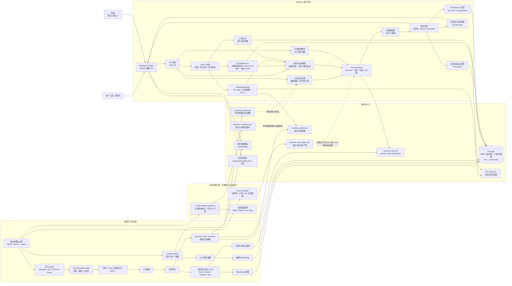
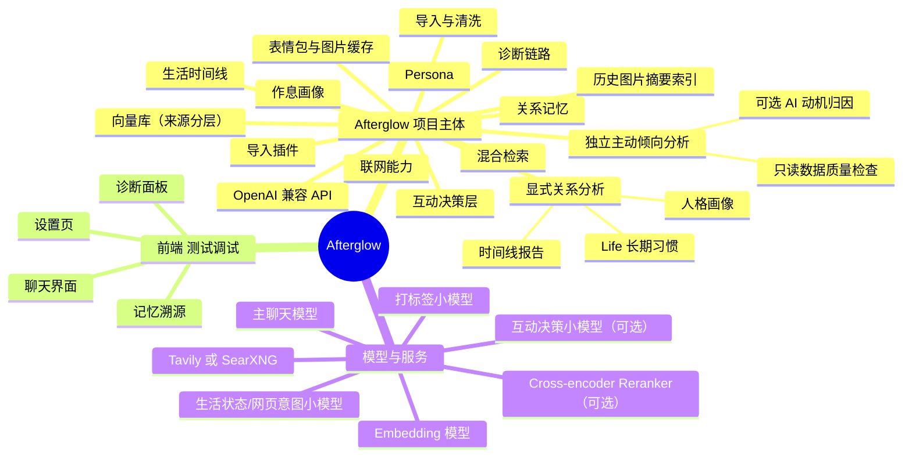

# 整体架构

## 关键设计

- **分层混合检索**：离线历史由 A/B/C 三类文本索引和 D 类 `history_images` 图片摘要索引构成，运行时另有 `live_messages`。HybridRetriever 内部并发执行五路向量召回，并同时读取当前会话 Recent Live；Layer A 外层再并发执行 HybridRetriever、关系记忆上下文和 Life 决策。
- **可选 Cross-encoder 粗排**：开启 `CROSS_RERANK_ENABLED=true` 后，RRF 召回的候选会先过一道专用 reranker 模型（如讯飞免费 `xop3qwen8breranker` 或 DashScope `qwen3-rerank`）按相关性精排，再注入主聊天 prompt——区分度比 LLM-as-reranker 更细，延迟仅 ~3s。
- **可选 Query 改写**：短句口语（"在吗 / 想你了 / 好累"）走 query rewrite 小模型展开为 1-3 个检索友好的变体，多变体命中按 `(best_rank, distance)` 合并，避免短 query 召回稀疏。
- **可选自适应切分**：导入期 `CHUNKING_STRATEGY=adaptive` 时按话题边界切聊天记录（启发式 / 小模型可选），比固定 12 条窗口更贴合自然话题；会话级并发可配，大库切分 30 秒内完成。
- **AI 回复连发分条**：主聊天 LLM 输出含 `\n\n` 时前端拆成多条独立气泡（独立头像 / 时间戳 / 名字），后续段错峰 2-5s 显示，模拟真人 IM 连发节奏。后端协议 100% 标准 OpenAI 兼容，第三方客户端零适配。
- **三层时间权重**：近期消息略增（recency boost ±15% 封顶）+ 暖度词加权（warmth boost）+ live/history 信任分层。
- **分层记忆防自污染**：运行时把用户输入标记为 `user_new`，把 AI 分身回复标记为 `ai_generated`。两者都可用于连续性检索，但 `ai_generated` 低权重，且不会参与 persona / 风格蒸馏；真正用于模仿对方语气的长期证据只来自真人原始聊天（`human_original`）。
- **AI 回复长期累积可控**：默认 `AI_GENERATED_LONG_TERM_ENABLED=false`，AI 回复只在同一会话内用于连续性；如果希望 AI 分身随着长期互动形成自己的变化轨迹，可以开启该项，让 `ai_generated` 跨会话参与低权重语义检索。
- **持续生长记忆**：每轮对话都异步回写 `live_messages`，向量库不再是一次性快照。
- **本轮互动决策层**：生成回复前先判断本轮该认真、安抚、撒娇、接梗、转移、沉默、发图还是表情；也会在用户烦躁、崩溃、失眠、关系压力等场景下禁止继续刺激用户。规则引擎兜底安全场景；如果开启 `RESPONSE_POLICY_MODEL_ENABLED`，会再叫一次小模型做有界微调（不能降级 risk、不能撤销规则给的安全/沉默/要图/要表情判断）。
- **沉默与延迟响应**：决策层判断本轮不应回复时直接短路，不调主模型，返回 `finish_reason="silenced"` + sentinel content + `policy.should_reply=false`；生活状态建议的拟人化延迟放在 `policy.reply_delay_seconds`，由客户端决定何时展示。
- **三条独立离线路径**：`xuwen import` 负责向量索引及 persona、风格、作息和轻量主动画像；`xuwen analyze` 由用户显式运行，负责时间线、人格、Life 和实验画像；`xuwen analyze-proactive` 由用户单独决定运行，只负责主动倾向统计及可选 AI 动机归因。普通导入或关系分析都不会触发主动消息 AI 归因。
- **分析产物按需消费**：时间线当前只通过分析 API/前端展示，不注入聊天；人格画像只有在 `ANALYSIS_PERSONALITY_PROMPT_ENABLED=true` 时进入主 Prompt；Life 习惯只有在 `ANALYSIS_LIFE_CONTEXT_ENABLED=true` 时进入状态决策。
- **主动聊天学习（实验性，不推荐使用，默认关闭）**：运行时优先读取独立的 `proactive_analysis.json` 做时间、星期、空闲间隔和开场类型调度；报告缺失、损坏或无有效样本时回退导入期 `proactive_profile.json`，再回退向量库窗口。质量检查脚本只读报告并给出启用建议，不会调用 AI 或自动改变开关。`/v1/companion/proactive/poll` 到点后仍会二次执行防打扰门控，并从记忆、关系上下文和最近缓存中选择话题钩子。
- **真实时间 + 生活状态**：每次模型调用都会收到当前时区下的真实时间；生活时间线由可配置小模型维护，回答"在干嘛/吃了吗/睡没睡"时优先使用当前状态。fail-open 兜底：LLM 调用失败也写入最小 fallback state，避免每轮死循环重试。
- **可选联网**：后端默认支持 Tavily，也可切到 SearXNG；在明确需要公开实时信息时把网页摘要注入 prompt，默认关闭。
- **大库索引加速**：`uv run python -m xuwen.ingestion.cli index` 一键给 LanceDB 向量表建 IVF_PQ 索引，10 万行以上规模时检索耗时降一个数量级；`cli optimize` 定期合并增量入索引。
- **零微调**：完全靠 RAG + Prompt Engineering + Persona 卡片，不动模型权重。
- **时光信笺 UI**：米色信笺 + 黛蓝墨痕 + 思源宋体 + 暖光粒子 + 拟人化打字节奏 + 记忆溯源浮窗。

---
